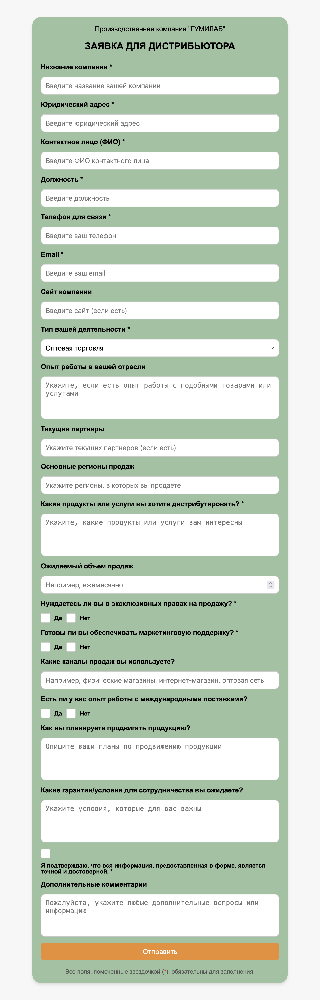

# Форма заявки

Этот проект представляет собой форму для подачи заявки от компанию. Он позволяет заполнять необходимую информацию о компании, своей деятельности и запросах на продукцию, а также отправлять данные напрямую в Telegram.

## Основные функции

- Поля для ввода информации о компании: название, адрес, контактное лицо и т.д.
- Выбор типа деятельности и запрос на эксклюзивные права или маркетинговую поддержку.
- Возможность указать опыт работы, текущих партнеров и основные регионы продаж.
- Интеграция с Telegram для автоматической отправки заполненной заявки в указанный чат.

## Используемые технологии

- **HTML5** и **CSS** — структура и стилизация формы.
- **JavaScript** — обработка данных формы и отправка в Telegram через API.
- **Select2** — улучшение функциональности выпадающих списков.
- **Telegram Bot API** — интеграция с Telegram для отправки заявок.

## Установка и запуск

1. Склонируйте репозиторий:
   ```bash
   git clone <URL-вашего-репозитория>
   ```

2. Убедитесь, что все файлы проекта находятся в папке:
   - `index.html` — основной файл с формой.
   - `styles.css` — стили для формы.
   - `reset.css` — сброс стилей браузера.
   - `script.js` — скрипт для обработки формы и отправки данных.

3. Настройте токен Telegram Bot:
   - В файле `script.js` замените `TELEGRAM_TOKEN` на токен вашего бота.
   - Укажите ID вашего чата или канала в переменной `CHAT_ID`.

4. Запустите проект:
   - Просто откройте файл `index.html` в браузере.

## Инструкция по настройке Telegram бота

1. Создайте бота с помощью [BotFather](https://t.me/BotFather) в Telegram.
2. Получите токен для бота.
3. Узнайте ID чата или канала:
   - Добавьте вашего бота в чат/канал.
   - Используйте API Telegram, чтобы получить `chat_id`.

## Пример использования

1. Заполните форму с информацией о вашей компании и запросе на продукцию.
2. Нажмите кнопку "Отправить".
3. Вся информация будет отправлена в указанный Telegram-чат.

## Зависимости

- [Select2](https://select2.org/) (v4.0.13) — для улучшения выпадающих списков.
- [Telegram Bot API](https://core.telegram.org/bots/api) — для отправки данных формы.

## Скриншот интерфейса



## Лицензия

Этот проект находится под лицензией MIT. Свободно используйте, изменяйте и распространяйте.

## Контакты

Если у вас есть вопросы или предложения, свяжитесь с нами:

- **Telegram:** [@romanburov](https://t.me/romanburov)
